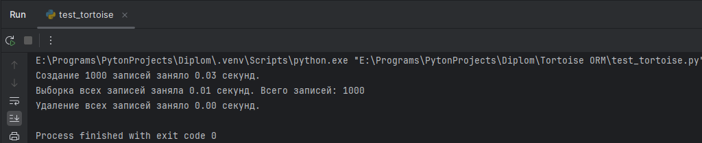

Данный проект создан, для сравнения производительности и удобства использования различных библиотек ORM (
Object-Relational Mapping): Django ORM, SQLAlchemy и Tortoise ORM. Приложение Django созданное в рамках этого проекта
позволяет пользователям взаимодействовать с базой данных через веб-интерфейс, предоставляя возможность создания,
редактирования, удаления и просмотра постов блога

Функциональность
Основные функции:
Создание постов: Пользователи могут добавлять новые посты с заголовком и содержимым.
Редактирование постов: Пользователи могут изменять существующие посты.
Удаление постов: Пользователи могут удалять свои посты.
Просмотр списка постов: Все посты отображаются на главной странице, с возможностью просмотра каждого поста в
отдельности.
Пагинация: Длинные списки постов разбиваются на страницы для удобства навигации.
Фильтрация: Пользователи могут фильтровать посты по различным критериям (например, по дате публикации или заголовку).

Дополнительные функции:
Аутентификация пользователей: Пользователи могут регистрироваться и входить в систему для управления своими постами.
Комментарии: Возможность оставлять комментарии к постам.
Поиск: Функция поиска по заголовкам и содержимому постов.

Технологии
Django: Основной фреймворк для разработки веб-приложения.
SQLAlchemy: Альтернативная библиотека ORM для работы с базами данных.
Tortoise ORM: Асинхронная библиотека ORM для работы с базами данных.
PostgreSQL: Система управления базами данных для хранения данных приложения.

Результаты тестирования DjangoORM:

Результы тестирования SQLAlchemyORM:

Результаты тестирования TortoiseORM:

Сравнение результатов тестирования:

Вывод:
Выбор между Django ORM, SQLAlchemy и Tortoise ORM зависит от конкретных требований вашего проекта, уровня опыта
разработчиков и специфики работы с базами данных. Проведенные тесты показывают, что каждая из библиотек имеет свои
сильные и слабые стороны, которые необходимо учитывать при принятии решения. Django ORM: Отличается высокой легкостью в
использовании и хорошей документацией, что делает его идеальным выбором для начинающих разработчиков. Однако его
производительность может быть ниже в некоторых сценариях по сравнению с SQLAlchemy. Django ORM использует подход «Active
Record», при котором модели напрямую связаны с таблицами базы данных. Это упрощает разработку, но может ограничивать
гибкость при сложных запросах. В отличие от этого, SQLAlchemy использует шаблон «Data Mapper», который отделяет
бизнес-логику от структуры базы данных, позволяя более эффективно управлять сложными запросами и оптимизировать
производительность.

Tortoise ORM, как и SQLAlchemy, также использует асинхронный подход, что позволяет ему лучше справляться с высокими
нагрузками и большим количеством одновременных подключений. SQLAlchemy: Предлагает высокую
гибкость и мощные инструменты для построения сложных запросов, что делает его предпочтительным выбором для более опытных
разработчиков, работающих с большими объемами данных. Недостатки SQLAlchemy
Сложность в использовании:
SQLAlchemy предлагает мощные возможности, но его сложный интерфейс может быть трудным для понимания, особенно для
новичков. Разработчикам необходимо изучить как синтаксис SQLAlchemy, так и SQL, что добавляет когнитивную нагрузку.
Производительность:
Некоторые пользователи отмечают, что производительность построения запросов в SQLAlchemy может быть ниже ожидаемой. Это
связано с тем, что ORM требует дополнительных затрат на преобразование объектов и управление сессиями. В случаях высокой
нагрузки это может стать узким местом.
Необходимость явного указания связей:
В отличие от Django ORM, где связи между моделями могут быть определены более интуитивно, в SQLAlchemy разработчики
должны явно указывать все соединения (joins) и другие параметры запросов, что может усложнить код.
Отсутствие встроенной поддержки для некоторых баз данных:
Хотя SQLAlchemy поддерживает множество баз данных, некоторые специфические функции могут не поддерживаться или требовать
дополнительных усилий для реализации

Tortoise ORM: Поддерживает асинхронные операции, что делает его подходящим для современных веб-приложений, требующих
высокой производительности и масштабируемости. Тем не менее, его документация и сообщество могут быть менее развитыми по
сравнению с другими библиотеками.
Недостатки Tortoise ORM:
Меньшая популярность и сообщество:
Tortoise ORM менее известен по сравнению с SQLAlchemy и Django ORM, что может привести к меньшему количеству доступных
ресурсов, документации и поддержки сообщества.
Ограниченная функциональность:
Хотя Tortoise ORM поддерживает основные функции работы с базами данных, он может не иметь такой же степени гибкости и
возможностей для создания сложных запросов, как SQLAlchemy. Это может ограничить его использование в более сложных
проектах.
Асинхронная природа:
Tortoise ORM ориентирован на асинхронное программирование, что может стать проблемой для разработчиков, которые не
знакомы с асинхронными паттернами или работают в синхронной среде.
Проблемы с миграциями:
Некоторые пользователи сообщают о проблемах с управлением миграциями схемы базы данных в Tortoise ORM, что может
усложнить процесс обновления структуры базы данных.